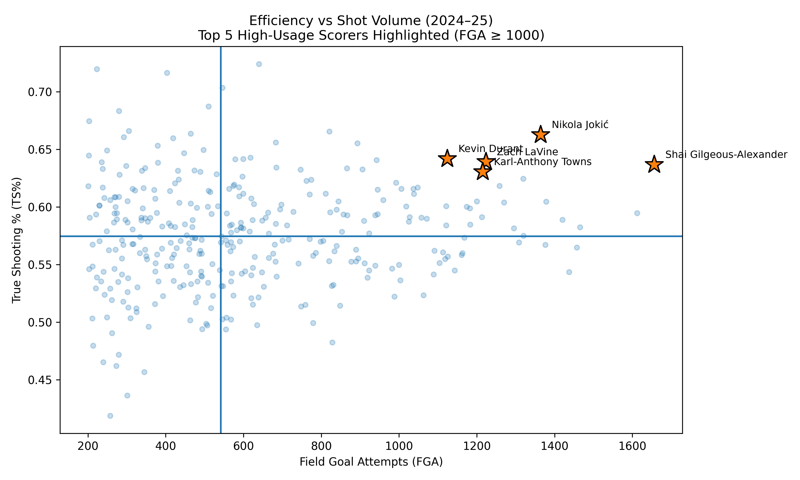

# NBA Player Efficiency Analysis

Analysis of scoring efficiency among high-usage NBA players during the 2024–25 regular season using Python, Pandas, and Matplotlib.

## Methodology

True Shooting Percentage (TS%) was used to measure scoring efficiency:

**TS% = Points / (2 × (FGA + 0.44 × FTA))**

Raw TS% rankings are often dominated by lower-usage players who primarily take high-percentage shots. To focus the analysis on high-volume offensive players, players were filtered using a minimum threshold of **1,000 field goal attempts (FGA)**.

## Results

### Top 5 Most Efficient High-Usage Scorers

1. Nikola Jokić — TS%: 0.663
2. Kevin Durant — TS%: 0.642
3. Zach LaVine — TS%: 0.639
4. Shai Gilgeous-Alexander — TS%: 0.637
5. Karl-Anthony Towns — TS%: 0.630

## Key Findings

- Nikola Jokić led all high-volume scorers in efficiency while maintaining elite offensive production.
- The top performers combined shot selection, playmaking, and scoring versatility.
- Filtering by shot volume significantly changed the rankings compared with raw TS% leaderboards.
- High-usage efficiency provides a useful way to compare the scoring performance of major offensive players.

## Visualization

## Tools Used

- Python
- Pandas
- Matplotlib
- Jupyter Notebook
